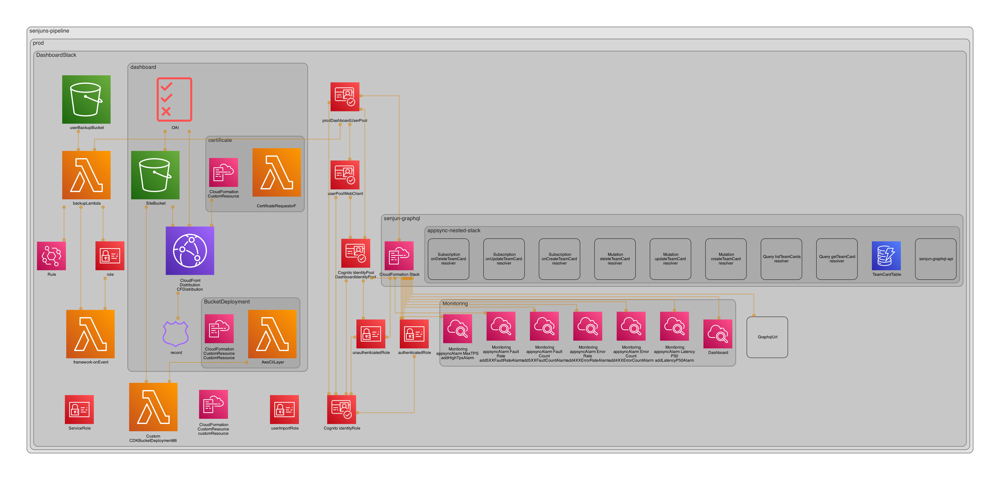

# backend

## AWS component diagram

This diagram can be generated out of the CDK code with `yarn dia`

### Landingpage


### Dashboard



### Slack

Creating a Slack Bot <https://slack.dev/bolt-js/tutorial/getting-started>

You'll need an .env file:

```bash
cp .env-example .env
```

And insert valid values.

Then, you can start the local socket connection to Slack:

```sh
npx esno src/main.local.ts
```

## CDK bootstrap

<https://docs.aws.amazon.com/cdk/v2/guide/bootstrapping.html>

```bash
ACCOUNT_BUILD_ID=456906467194
yarn cdk bootstrap aws://$ACCOUNT_BUILD_ID/us-east-1 aws://$ACCOUNT_BUILD_ID/eu-central-1

ACCOUNT_DEV_ID=240818873559
yarn cdk bootstrap aws://$ACCOUNT_DEV_ID/us-east-1 aws://$ACCOUNT_DEV_ID/eu-central-1 --cloudformation-execution-policies arn:aws:iam::aws:policy/AdministratorAccess --trust $ACCOUNT_BUILD_ID

ACCOUNT_PROD_ID=768874568263
yarn cdk bootstrap aws://$ACCOUNT_PROD_ID/us-east-1 aws://$ACCOUNT_PROD_ID/eu-central-1 --cloudformation-execution-policies arn:aws:iam::aws:policy/AdministratorAccess --trust $ACCOUNT_BUILD_ID
```

## How to deploy locally

**Notice:** Deploying shouldn't be done manually if not necessary! The BitBucket pipeline can and should deploy changes. Anyway if you decide deploy manually read the next sections.

${STAGE} can be dev or prod.

Build the React build folders first with:

```bash
yarn buildReactApps
```

Synthing the CDK APP can be done with going to backend/${STAGE} and run:

```bash
yarn synth
```

Deploy with:

```bash
yarn deploy
```

For listing all available stacks do:

```bash
yarn cdk list
```

Or with the new watch flag a faster deploying for local development:

```bash
yarn cdk deploy 'dev-...Stack'
yarn cdk deploy 'dev-...Stack' --watch
yarn cdk deploy 'dev-...Stack' --require-approval never
STAGE=dev
yarn cdk deploy "senjuns-pipeline/$STAGE/DashboardStack" --require-approval never
yarn cdk deploy "senjuns-pipeline/$STAGE/LandingPageStack" --require-approval never
yarn cdk deploy "senjuns-pipeline/$STAGE/BotStack" --require-approval never
```

For destroy do

```bash
yes | yarn cdk destroy "senjuns-pipeline/$STAGE/DashboardBackendStack"
```

For setup access to the specific stage get your programmatic credentials via AWS SSO and store them in ~/.aws/credentials or more convenient store them as environment variables.

## Deploy Pipeline

```bash
yarn cdk deploy 'senjuns-pipeline' --require-approval never
yes | yarn cdk destroy 'senjuns-pipeline'
```

## Cognito

Create User

```bash
REGION=eu-central-1
# dev
# USER_POOL_ID=eu-central-1_voL4v2egL
USER_POOL_ID=$(curl https://dashboard.dev.senjuns.com/runtime-config.json | jq -r '.userPoolId')

USER_NAME=martinmueller@senjuns.com
USER_PASSWORD=M@rtin1988

aws cognito-idp admin-create-user --user-pool-id $USER_POOL_ID --username $USER_NAME --user-attributes Name=email,Value=$USER_NAME --region $REGION --output text
aws cognito-idp admin-set-user-password --user-pool-id $USER_POOL_ID --username $USER_NAME --password $USER_PASSWORD  --permanent --region $REGION
```

## AppSync

Seed the AppSync managed DynamoDB with the AWS Console -> AppSync using test/create-team-card-data.graphql
